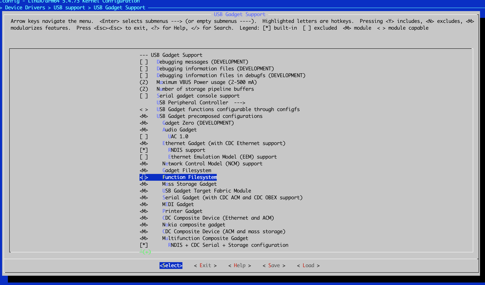

##  build kernel and install it

编译内核打开USB FFS选项



安装内核

```
sudo cp /boot/vmlinuz-5.4.0-1023-raspi /boot/firmware/vmlinuz
sudo cp /boot/initrd.img-5.4.0-1023-raspi /boot/firmware/initrd.img
```

## 强制usb口运行于device模式

sudo vim /boot/firmware/config.txt

```
dtoverlay=dwc2,dr_mode=peripheral
```


